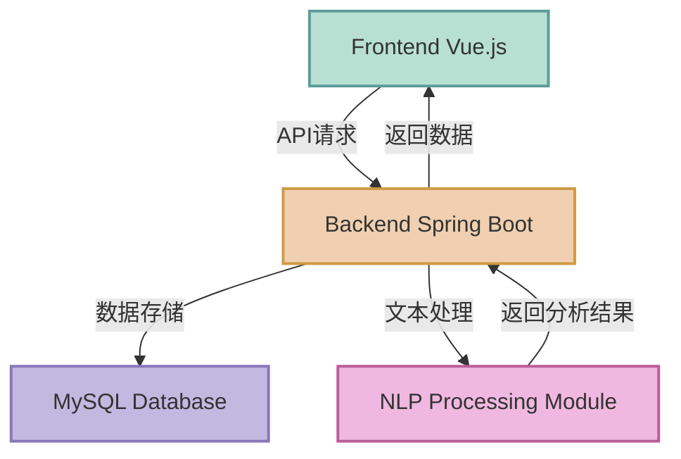

# 📚 NovelSight 小说智析 | Novel Assistant1

<div align="center">
  
  
  
  
  <br><br>
  <p>
      <strong>An AI-driven novel content analysis and summary generation system</strong>
  </p>
  <p>
      <a href="#core-features">💡 Features</a> •
      <a href="#quick-start">🚀 Quick Start</a> •
      <a href="#system-architecture">🏗️ Architecture</a> •
      <a href="#tech-stack">⚙️ Tech Stack</a> •
      <a href="#project-progress">📊 Progress</a> •
      <a href="#contact">QQ: 1610494022</a>
  </p>
</div>

# NovelSight 小说智析 (Novel Assistant)


<div align="center">
    <p>
        <strong>An AI-driven novel content analysis and summary generation system</strong>
    </p>
    <p>
        <a href="#core-features">Features</a> •
        <a href="#quick-start">Quick Start</a> •
        <a href="#system-architecture">Architecture</a> •
        <a href="#demo">Demo</a> •
        <a href="#contributing">Contribute</a>
    </p>
</div>


## 🌟 Project Overview

> **Make novel reading more efficient and content understanding more profound**
Contact:
        QQ: 1610494022
### 💬 The pitfalls I've encountered while reading novels over the years

I encountered these problems while reading novels, which led me to create this software
One, the pitfalls I've encountered while reading novels over the years

- As a seasoned novel enthusiast, I often encountered these frustrations while reading:
- Difficult screening: Faced with hundreds of novels on the bookshelf, I didn't know which one was "safe to read"--
- The introduction is written brilliantly, but the plot is dragged out, and the characters are inconsistent, such as a sci-fi novel where the first 10 chapters are all about piling up technical terms, and the main plot progresses very slowly.
- Wanting to find "non-stereotypical" novels, but only being able to rely on netizens' comments for blind selection, which is time-consuming and inefficient.

Two, understanding is tiring:

- Complex world-view novels (such as cultivation systems, interstellar settings), the chapter content is scattered, and you can't remember the core settings after reading, such as a fantasy novel with 300 sect settings that is completely incomprehensible.
- Long-chapter novels (such as million-word online novels), with a lot of filler content in the middle, wanting to skip the "water chapters" but afraid of missing the main plot, such as a historical novel where every 5 chapters has 2 chapters describing the daily life of unrelated supporting characters.
  - Whether you want to quickly understand a new novel or deeply analyze your favorite work, the Novel Reading Assistant can help.

As a seasoned novel enthusiast, I frequently encountered these frustrations while reading:

#### 📋 Screening difficulties

- Faced with hundreds of novels on the bookshelf, I didn't know which one was "safe to read"
- The introduction is written brilliantly, but the plot is dragged out and the characters are inconsistent
- Wanting to find "non-stereotypical" novels, but only being able to rely on netizens' comments for blind selection, which is time-consuming and inefficient

#### 📖 Understanding is laborious

- Complex world-view novels (such as cultivation systems, interstellar settings), the chapter content is scattered, and you can't figure out the core settings
- Long-chapter novels have a lot of filler content in the middle, wanting to skip the "water chapters" but afraid of missing the main plot

**NovelSight** uses AI technology to analyze novel content, extract key plot points, generate summaries and tags, and save you from the trouble of screening and understanding. Whether you want to quickly understand a new novel or deeply analyze your favorite work, NovelSight can provide professional help.

## 📊 Project Progress

### ✅ Completed features

<table>
  <tr>
    <td><b>Basic Infrastructure Setup</b></td>
    <td>
      ✓ Frontend framework setup (Vue.js 3 + Element Plus)<br>
      ✓ Backend framework setup (Spring Boot 3.2.4)<br>
      ✓ Database configuration (MySQL 8.2.0)<br>
      ✓ Basic API design and implementation
    </td>
  </tr>
  <tr>
    <td><b>User Authentication System</b></td>
    <td>
      ✓ User registration/login functionality<br>
      ✓ JWT token authentication<br>
      ✓ Role-based access control<br>
      ✓ Login status management and dynamic display of user information
    </td>
  </tr>
  <tr>
    <td><b>Admin Backend</b></td>
    <td>
      ✓ Admin dashboard<br>
      ✓ User management interface<br>
      ✓ Novel management interface<br>
      ✓ System log viewing interface
    </td>
  </tr>
  <tr>
    <td><b>Basic UI Components</b></td>
    <td>
      ✓ Navigation bar and page layout<br>
      ✓ Login and registration forms<br>
      ✓ User dropdown menu<br>
      ✓ Novel list display
    </td>
  </tr>
  <tr>
    <td><b>Core Business Process</b></td>
    <td>
      ✓ Novel file upload functionality<br>
      ✓ Simple chapter recognition and extraction<br>
      ✓ Novel processing status tracking<br>
      ✓ Basic novel details viewing<br>
      ✓ User novel statistics function<br>
      ✓ My novel list display<br>
      ✓ Text processing security enhancement (automatic truncation of long text)<br>
      ✓ Novel soft deletion and recovery functionality
    </td>
  </tr>
  <tr>
    <td><b>System Security</b></td>
    <td>
      ✓ Solved Spring Security circular dependency problem<br>
      ✓ Fixed AccessDeniedException error<br>
      ✓ Optimized authentication and authorization process<br>
      ✓ Upgraded to Spring Boot 3.x compatibility<br>
      ✓ Enhanced API error handling mechanism<br>
      ✓ Fixed database field length overflow problem
    </td>
  </tr>
  <tr>
    <td><b>Visualization System</b></td>
    <td>
      ✓ Keyword cloud implementation (based on ECharts-wordcloud)<br>
      ✓ Emotional fluctuation chart drawing (based on ECharts line chart)<br>
      ✓ Novel structure analysis visualization (two-layer pie chart)<br>
      ✓ Character relationship network visualization (based on force-directed graph)<br>
      ✓ Visualization database design and implementation<br>
      ✓ Visualization API interface development<br>
      ✓ Visualization technical documentation writing<br>
      ✓ Fixed ESLint errors in visualization components<br>
      ✓ Optimized character relationship network chart performance and style<br>
      ✓ Completed component comments and API documentation<br>
      ✓ Optimized character relationship data processing, reducing data volume
    </td>
  </tr>
  <tr>
    <td><b>Technical Documentation</b></td>
    <td>
      ✓ System architecture documentation<br>
      ✓ API interface documentation<br>
      ✓ Visualization component usage guide<br>
      ✓ Developer documentation<br>
      ✓ Troubleshooting guide<br>
      ✓ Development log updates
    </td>
  </tr>
</table>


### 🔄 Pending tasks

<table>
  <tr>
    <th>Category</th>
    <th>Task</th>
    <th>Priority</th>
  </tr>
  <tr>
    <td rowspan="3"><b>Core Feature Enhancement</b></td>
    <td>Enhance Chinese online novel chapter recognition</td>
    <td>High</td>
  </tr>
  <tr>
    <td>Improve summary generation algorithm to reduce repetitive content</td>
    <td>High</td>
  </tr>
  <tr>
    <td>Implement keyword extraction and tag generation</td>
    <td>High</td>
  </tr>
  <tr>
    <td rowspan="2"><b>Data Visualization Enhancement</b></td>
    <td>Implement word count distribution statistics chart</td>
    <td>Medium</td>
  </tr>
  <tr>
    <td>Add visualization data export functionality</td>
    <td>Low</td>
  </tr>
  <tr>
    <td rowspan="3"><b>User Experience Optimization</b></td>
    <td>Add user preference settings</td>
    <td>Medium</td>
  </tr>
  <tr>
    <td>Implement dark mode</td>
    <td>Low</td>
  </tr>
  <tr>
    <td>Optimize mobile responsive design</td>
    <td>Medium</td>
  </tr>
  <tr>
    <td rowspan="3"><b>Advanced Analysis Features</b></td>
    <td>Novel content sentiment analysis</td>
    <td>Low</td>
  </tr>
  <tr>
    <td>Writing style recognition</td>
    <td>Low</td>
  </tr>
  <tr>
    <td>Novel similarity comparison function</td>
    <td>Low</td>
  </tr>
  <tr>
    <td rowspan="3"><b>System Performance Optimization</b></td>
    <td>Large file processing performance optimization</td>
    <td>Medium</td>
  </tr>
  <tr>
    <td>Database query optimization</td>
    <td>High</td>
  </tr>
  <tr>
    <td>Frontend resource loading optimization</td>
    <td>Low</td>
  </tr>
  <tr>
    <td rowspan="3"><b>Deployment & CI/CD</b></td>
    <td>Containerization deployment solution</td>
    <td>Medium</td>
  </tr>
  <tr>
    <td>Automated testing process</td>
    <td>Medium</td>
  </tr>
  <tr>
    <td>Continuous integration and deployment process</td>
    <td>Low</td>
  </tr>
</table>


## 💡 Core Features

### 🔍 Automated Text Processing

- 🗃️ **Multi-source input**: Support TXT, EPUB format file uploads and web page link parsing
- 📑 **Chapter identification**: Automatically identify chapter titles, extract main content, and filter advertisements
- 🔄 **Batch processing**: Support batch import and processing of multiple novels

### 📝 Intelligent Summary Generation

- 📌 **Layered summary**: Provide chapter summaries, plot flow charts, and full book overviews
- 🧠 **Content understanding**: Use natural language processing to understand novel plots and themes
- 📊 **Structured output**: Convert unstructured text into structured information

### 📊 Novel Data Visualization

- 🔍 **Keyword cloud**: Intuitively display high-frequency words and key concepts in novels to help quickly grasp core themes
  - Automatically generated based on word frequency and importance weighting
  - Support custom colors and layouts
  - Responsive design, suitable for various screen sizes

- 📈 **Emotional fluctuation chart**: Display novel plot ups and downs and emotional changes
  - Visualize story plot tension and emotional intensity
  - Mark important plot points and climax turns
  - Help readers understand narrative structure and rhythm

- 🥧 **Structure analysis chart**: Use a two-layer pie chart to display novel overall structure and chapter distribution
  - Inner circle shows main structure (beginning, development, climax, ending, etc.)
  - Outer circle shows detailed division (each sub-plot, turning point, etc.)
  - Interactive design, click to view details of each part

- 👨‍👩‍👧‍👦 **Character relationship network diagram**: Visualize character relationships in novels
  - Based on force-directed graph to display character relationships
  - Node size reflects character importance
  - Connecting lines represent relationship type and strength between characters
  - Support interactive exploration, mouse hover to view character introduction
  - Adaptive layout, smart arrange complex relationship network
  - Automatically identify character relationships in dialogue content
  - Optimize memory usage, support display of large number of character nodes
  - Intelligent filtering algorithm, only display key characters and important relationships (up to 8 characters and 12 relationships)
  - Enhance performance, reduce data volume, achieve more smooth interaction experience

- ⚙️ **Technical implementation**:
  - Built on ECharts visualization library for responsive charts
  - Front-end and back-end separation architecture, data caching optimization
  - Structured data storage, support real-time updates

- 🔗 **API interfaces**:
  - `/novels/visualization/{novelId}/keywords`: Get keyword cloud data
  - `/novels/visualization/{novelId}/emotional`: Get emotional fluctuation data
  - `/novels/visualization/{novelId}/structure`: Get structure analysis data
  - `/novels/visualization/{novelId}/characters`: Get character relationship network data
  - `/novels/visualization/{novelId}/all`: Get all visualization data

### 🏷️ Personalized Tag System

- 👍 **Recommendation tags**: Highlight novel's positive aspects
- ⚠️ **Warning tags**: Point out novel's potential problems
- 🚪 **Reading threshold**: Explain required prior knowledge for reading

## ⚙️ Tech Stack

### Backend Technology Details

#### 🔧 Core Frameworks

* **JDK**: Oracle JDK 11.0.21 (LTS version)
  * Modular System Support
  * Enhanced String API
  * Improved Garbage Collector
  * Sealed Classes
* **Spring Ecosystem**:
  * Spring Boot 3.2.4
    * Auto-configuration
    * Embedded Server (Tomcat 10.1.x)
    * Production-ready Features
    * Jakarta EE 10 Support
  * Spring Framework 6.1.x
    * IoC Container
    * AOP Support
    * WebMVC Framework
  * Spring Security 6.2.x
    * Authentication & Authorization
    * Password Encryption (BCrypt)
    * CORS Configuration
  * Spring Data JPA 3.2.x
    * Repository Pattern
    * Dynamic Query Generation
    * Audit Features

#### 💾 Data Persistence Layer

* **ORM Framework**:
  * Hibernate 6.4.x
    * Second-level Cache
    * Lazy Loading
    * Batch Processing
* **Database**:
  * MySQL 8.2.0
    * InnoDB Engine
    * UTF8MB4 Character Set
    * Optimized Index

#### 🔐 Security Framework

* **JWT**: jjwt 0.11.5
  * Stateless Authentication
  * Configurable Expiration
  * Refresh Token Support
* **Encryption Algorithms**:
  * BCrypt (10 rounds encryption)
  * HTTPS/TLS 1.3
* **Security Protections**:
  * XSS Protection
  * CSRF Protection
  * SQL Injection Protection

#### 📝 Document Processing

* **Text Parsing**:
  * JSoup 1.16.2 (HTML Parsing)
  * Apache PDFBox 3.0.1
  * Apache POI 5.2.5 (Office Documents)
* **Natural Language Processing**:
  * HanLP portable-1.8.4
    * Chinese Word Segmentation
    * Named Entity Recognition
    * Keyword Extraction
  * OpenNLP 2.3.1

#### 🧠 Machine Learning and AI

* **Vector Models and Embeddings**:
  * Word2Vec model (trained on Chinese novel corpus)
  * GloVe embeddings (pre-trained version)
  * ChineseBERT word vectors (huggingface-bert-base-chinese)
* **Deep Learning Frameworks**:
  * DL4J (DeepLearning4J) 1.0.0-M2
    * Sequence model support
    * Matrix computation optimization
    * GPU acceleration support
  * TensorFlow Java API 2.10.1
* **Machine Learning Libraries**:
  * Apache Spark MLlib 3.3.2
    * Distributed machine learning algorithms
    * Text classification and clustering
  * Weka 3.9.6
    * Feature selection
    * Data preprocessing
* **Text Processing Algorithms**:
  * TextRank keyword extraction algorithm
  * Sentiment analysis model (based on CNN)
  * Character recognition and relationship extraction (based on BiLSTM-CRF)
  * Topic modeling (LDA model)

### Frontend Technology Details

#### 🎨 Core Frameworks

* **Vue.js 3.2.47**:
  * Composition API
  * Reactive System
  * Virtual DOM
* **State Management**:
  * Vuex 4.0.2
    * State Persistence
    * Modular Management
* **Routing Management**:
  * Vue Router 4.1.6
    * Dynamic Routing
    * Route Guard
    * Lazy Loading

#### 🎯 UI Framework

* **Element Plus 2.3.5**:
  * Responsive Layout
  * Theme Customization
  * Internationalization Support
* **Visualization**:
  * ECharts 5.4.2
    * Chart Components
    * Data Visualization
  * D3.js 7.8.5

#### 🔄 Toolchain

* **Build Tools**:
  * Vite 4.3.9
    * Fast Hot Reload
    * On-demand Compilation
* **Package Manager**:
  * Node.js 16.20.1
  * npm 8.19.4
* **Code Quality**:
  * ESLint 8.41.0
  * Prettier 2.8.8
* **Testing Framework**:
  * Jest 29.5.0
  * Vue Test Utils 2.3.2

### 🛠️ Development and Deployment Tools

#### Build Tools

* **Maven 3.8.8**:
  * Dependency Management
  * Lifecycle Management
  * Multi-module Building
* **Gradle 7.6.1** (Optional):
  * Incremental Building
  * Build Caching

#### Containerization

* **Docker 24.0.2**:
  * Multi-stage Building
  * Container Orchestration
* **Docker Compose 2.18.1**:
  * Service Definition
  * Environment Configuration

#### CI/CD

* **Jenkins 2.401.1**:
  * Pipeline as Code
  * Automated Deployment
* **Git 2.40.1**:
  * Version Control
  * Branch Management

#### Monitoring Tools

* **Spring Boot Actuator**:
  * Health Check
  * Metrics Collection
* **Prometheus + Grafana**:
  * Performance Monitoring
  * Visualization Dashboard

## 🏗️ System Architecture



## 🚀 Quick Start

### 📋 System Requirements

- ☕ Java 11.0+ (Recommended JDK 11.0.21)
- 🟢 Node.js 16+ (Recommended 16.20.1)
- 🐬 MySQL 8.0+
- 🏗️ Maven 3.6+

### 🔧 Installation Steps

<details>
<summary><b>1. Configure Database</b></summary>
1. **Configure Database**
```bash
# Create database and table structure
mysql -u root -p < sql/schema.sql


# Optional: Import sample data

mysql -u root -p < sql/sample_data.sql

```
<details>
<summary><b>2. Configure Backend</b></summary>

2. **Configure Backend**
```bash
cd backend
# Modify database connection information in application.properties
mvn clean install
```

</details>

<details>
<summary><b>3. Start Backend Service</b></summary>
3. **Start Backend Service**
```bash
```
</details>

## Novel Soft Deletion Feature Implementation Description

### April 22, 2025 Update: Implementation of Novel Soft Deletion Feature

To enhance data security and user experience, the system now implements soft deletion of novels. When a user "deletes" a novel, the system no longer physically deletes the data but marks the novel as deleted. The novel will no longer be displayed to the user, but can be recovered if needed.

### Implementation Method

1. **Database Modification**:
   - Added `is_deleted` field to the `novels` table (TINYINT type), 0 indicates normal, 1 indicates deleted
   - Added index `idx_novels_is_deleted` to improve query performance

2. **Entity Class Modification**:
   - Added `isDeleted` field and corresponding getter/setter methods to the `Novel` class

3. **Repository Layer Modification**:
   - Added `findByIsDeletedFalse()` and other methods for querying non-deleted novels
   - Added `findByUserIdAndIsDeletedFalse()` and other user-specific query methods

4. **Service Layer Modification**:
   - Updated `deleteNovel()` method to implement soft deletion logic
   - Added `restoreNovel()` method to allow recovery of deleted novels
   - Added `getDeletedNovelsByUserId()` method to retrieve user-deleted novels

5. **Controller Layer Modification**:
   - Added `/novels/{id}/restore` endpoint to implement novel recovery functionality
   - Added `/user/novels/deleted` endpoint to retrieve user-deleted novel list

### Functional Advantages

1. **Data Security**: Avoids data loss from accidental deletion
2. **User Experience**: Provides recovery mechanism for users to retrieve deleted novels
3. **Easy Implementation**: Implemented through flag field, minimal impact on existing code
4. **Performance Friendly**: Soft deletion mechanism has no significant impact on system performance

### Usage Method

- Delete novel: Use original deletion API, system will perform soft deletion
- View deleted novels: `GET /user/novels/deleted`
- Recover deleted novel: `POST /novels/{id}/restore`

## 📝 Development Log

### April 24, 2025
| Time | Work Content | Status |
|------|---------|------|
| **10:00-12:30** | Optimize character relationship network data processing<br>Simplify character relationship analysis algorithm<br>Implement intelligent filtering, only retain important characters and relationships | ✅ |
| **14:00-16:00** | Modify character relationship processing in VisualizationServiceImpl<br>Limit return to max 8 characters and 12 relationships<br>Add importance sorting function | ✅ |
| **16:00-17:30** | Optimize frontend character relationship network visualization component<br>Improve rendering performance<br>Reduce memory usage | ✅ |
| **17:30-18:00** | Update technical documentation<br>Add optimization content to README<br>Update API documentation | ✅ |

### April 23, 2025
| Time | Work Content | Status |
|------|---------|------|
| **10:00-12:00** | Fix website crawler chapter title length storage error<br>Implement title truncation function in WebScraperServiceImpl<br>Optimize crawler for specific website (biaiqu.cc) | ✅ |
| **13:30-15:30** | Add title length check in ProcessingServiceImpl<br>Optimize truncation algorithm, retain chapter sequence information<br>Ensure compatibility with database varchar(255) limit | ✅ |
| **15:30-17:00** | Add additional title check in NovelServiceImpl<br>Enhance text processing security<br>Test novel grabbing from multiple sources | ✅ |
| **17:00-18:00** | Update technical documentation<br>Document problem solutions<br>Update README development log | ✅ |

### April 22, 2025
| Time | Work Content | Status |
|------|---------|------|
| **09:00-10:30** | Fix ESLint errors in frontend visualization components<br>Remove unused chartId variable in NovelVisualizationView<br>Update code standards for visualization components | ✅ |
| **10:30-12:00** | Optimize character relationship network visualization component<br>Improve relationship line style and interaction effects<br>Enhance chart performance, reduce redraw frequency | ✅ |
| **13:30-15:00** | Organize project file structure<br>Optimize API call process<br>Add missing component annotations | ✅ |
| **15:00-17:30** | Complete visualization module technical documentation<br>Update README development log<br>Document recent bug fixes and feature optimizations | ✅ |

### April 21, 2025
| Time | Work Content | Status |
|------|---------|------|
| **09:00-11:30** | Fix database field length limitation problem<br>Fix event_description column definition in EmotionalData entity<br>Change summary field definition in Chapter entity to MEDIUMTEXT | ✅ |
| **13:30-15:00** | Optimize text processing flow<br>Add long text automatic truncation function<br>Avoid database storage overflow | ✅ |
| **15:30-17:00** | Test novel upload and processing function<br>Verify text truncation logic<br>Confirm database table structure update | ✅ |
| **17:00-18:30** | Code optimization and problem troubleshooting<br>Update technical documentation and development log<br>Document field length problem solution | ✅ |

### April 20, 2025
| Time | Work Content | Status |
|------|---------|------|
| **09:00-11:30** | Frontend code cleanup and optimization<br>Remove redundant AnalyzeView component<br>Update routing system, remove /analyze route | ✅ |
| **13:30-15:30** | Fix page redirect logic after novel upload<br>Add lastUploadedNovelId state management<br>Optimize state polling and error handling | ✅ |
| **16:00-17:00** | Refactor novel visualization flow<br>Unify novel/:id/visualization routing<br>Update goToAnalyze method in related components | ✅ |
| **17:00-18:30** | Enhance NLP service dialogue extraction function<br>Improve Chinese quotation mark recognition regex<br>Implement extractDialogues method for more accurate character recognition | ✅ |

### April 18, 2025
| Time | Work Content | Status |
|------|---------|------|
| **09:00-11:30** | Write visualization system technical documentation<br>Detail system architecture and data flow<br>Supplement database table design description | ✅ |
| **13:30-15:30** | Add detailed annotations to structure analysis chart component<br>Create visualization component directory documentation<br>Supplement API interface documentation and usage examples | ✅ |
| **16:00-17:30** | Update main README documentation visualization section<br>Add visualization system FAQ solutions<br>Proofread all documentation for consistency | ✅ |

### April 17, 2025
| Time | Work Content | Status |
|------|---------|------|
| **09:00-11:30** | Fix frontend visualization component ECharts library dependency problem<br>Update all chart components to directly import echarts | ✅ |
| **13:30-15:30** | Optimize novel structure analysis chart component<br>Fix keyword cloud component wordcloud dependency problem<br>Unify echarts import and initialization method | ✅ |
| **16:00-17:30** | Adjust echarts reference<br>Successfully build frontend project to verify fixes<br>Resolve compilation warnings and improve loading performance<br>Optimize system log format and storage method | ✅ |

### April 15, 2025
| Time | Work Content | Status |
|------|---------|------|
| **09:00-11:00** | Fix frontend API call problem<br>Correct user statistics interface response processing<br>Optimize MyNovelsView component error handling | ✅ |
| **13:30-15:30** | Upgrade Spring Boot to 3.x version<br>Update all javax.* package references to jakarta.*<br>Fix JwtUtils compatibility problem | ✅ |
| **16:00-17:30** | Enhance error handling and log recording<br>Add API response debugging function<br>Implement data model default value settings | ✅ |

### April 14, 2025
| Time            | Work Content                                                     | Status |
| --------------- | ------------------------------------------------------------ | ---- |
| **09:30-11:30** | Solve Spring Security circular dependency problem<br>Fix AccessDeniedException error | ✅    |
| **13:00-15:00** | Perfect admin dashboard routing configuration<br>Create NovelManagementView and SystemLogsView components<br>Fix ESLint errors, optimize code structure | ✅    |
| **15:30-17:30** | Implement user login status management and dynamic display<br>Optimize Vuex storage, improve component display<br>Perfect login flow, role-based jump | ✅    |
| **17:30-18:00** | Code optimization and cleanup<br>Beautify login button and user dropdown menu style             | ✅    |
