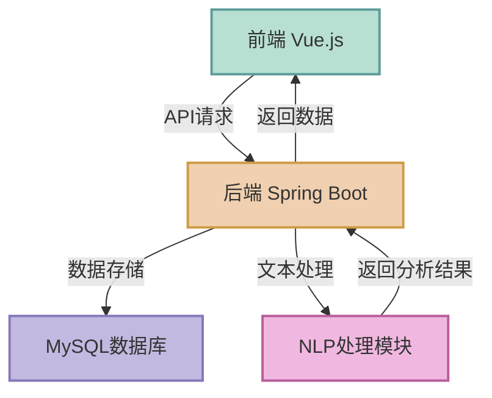

# 📚 NovelSight 小说智析 | Novel Assistant1

<div align="center">
  
  
  
  
  <br><br>
  <p>
      <strong>AI驱动的小说内容分析与摘要生成系统</strong>
  </p>
  <p>
      <a href="#核心功能">💡 功能</a> •
      <a href="#快速开始">🚀 快速开始</a> •
      <a href="#系统架构">🏗️ 架构</a> •
      <a href="#技术栈">⚙️ 技术栈</a> •
      <a href="#项目进度">📊 进度</a> •
      <a href="#联系方式">QQ: 1610494022</a>
  </p>
# NovelSight 小说智析 (Novel Assistant)


<div align="center">
    <p>
        <strong>AI驱动的小说内容分析与摘要生成系统</strong>
    </p>
    <p>
        <a href="#核心功能">功能</a> •
        <a href="#快速开始">快速开始</a> •
        <a href="#系统架构">架构</a> •
        <a href="#演示">演示</a> •
        <a href="#贡献指南">贡献</a>
    </p>
</div>


## 🌟 项目简介

> **让小说阅读更高效，内容理解更深入**
联系方式:
        qq:1610494022
### 💬 那些年读小说踩过的坑

我在看小说时遇到的问题，让我决定做这个软件
一、那些年读小说踩过的坑

- 作为一个资深小说爱好者，我在阅读中频繁遇到这些困扰：
- 筛选难：面对书架上几百本小说，不知道哪本 "不踩雷"——
- 简介写得天花乱坠，实际剧情拖沓、人设崩塌，比如某科幻小说前 10 章都在堆砌技术术语，主线剧情推进极慢。
- 想找 "反套路" 小说，却只能靠网友评论盲选，耗时又低效。

二、理解累：

- 复杂世界观小说（如修真体系、星际设定），章节内容零散，看完记不住核心设定，比如某玄幻小说里 300 个门派设定，根本理不清脉络。
- 长章节小说（如百万字网文），中间穿插大量填充内容，想跳过 "水章" 却担心错过主线，比如某历史小说每 5 章就有 2 章在描写无关的配角日常。
  -无论您是想快速了解一部新小说，还是希望深入分析您喜爱的作品，小说精读助手都能提供帮助。

身为资深小说爱好者，我在阅读中频繁遇到这些困扰：

#### 📋 筛选困难

- 面对书架上几百本小说，不知道哪本"不踩雷"
- 简介写得天花乱坠，实际剧情拖沓、人设崩塌
- 想找"反套路"小说，却只能靠网友评论盲选，耗时又低效

#### 📖 理解费力

- 复杂世界观小说（如修真体系、星际设定），章节内容零散，理不清核心设定
- 长篇小说中穿插大量填充内容，想跳过"水章"却担心错过主线剧情

**NovelSight** 通过AI技术解析小说内容，提取关键情节，生成摘要和标签，为您省去筛选和理解的烦恼。无论是快速了解一部新小说，还是深入分析您喜爱的作品，小说智析都能提供专业帮助。

## 📊 项目进度

### ✅ 已完成内容

<table>
  <tr>
    <td><b>基础架构搭建</b></td>
    <td>
      ✓ 前端框架搭建 (Vue.js 3 + Element Plus)<br>
      ✓ 后端框架搭建 (Spring Boot 3.2.4)<br>
      ✓ 数据库配置 (MySQL 8.2.0)<br>
      ✓ 基本API设计和实现
    </td>
  </tr>
  <tr>
    <td><b>用户认证系统</b></td>
    <td>
      ✓ 用户注册/登录功能<br>
      ✓ JWT令牌认证<br>
      ✓ 基于角色的权限控制<br>
      ✓ 登录状态管理和动态显示用户信息
    </td>
  </tr>
  <tr>
    <td><b>管理员后台</b></td>
    <td>
      ✓ 管理员仪表盘<br>
      ✓ 用户管理界面<br>
      ✓ 小说管理界面<br>
      ✓ 系统日志查看界面
    </td>
  </tr>
  <tr>
    <td><b>基础UI组件</b></td>
    <td>
      ✓ 导航栏和页面布局<br>
      ✓ 登录和注册表单<br>
      ✓ 用户下拉菜单<br>
      ✓ 小说列表显示
    </td>
  </tr>
  <tr>
    <td><b>核心业务流程</b></td>
    <td>
      ✓ 小说文件上传功能<br>
      ✓ 简单的章节识别与提取<br>
      ✓ 小说处理状态跟踪<br>
      ✓ 基本的小说详情查看<br>
      ✓ 用户小说统计功能<br>
      ✓ 我的小说列表展示<br>
      ✓ 文本处理安全性增强（长文本自动截断）<br>
      ✓ 小说软删除与恢复功能
    </td>
  </tr>
  <tr>
    <td><b>系统安全性</b></td>
    <td>
      ✓ 解决Spring Security循环依赖问题<br>
      ✓ 修复AccessDeniedException错误<br>
      ✓ 优化认证授权流程<br>
      ✓ 升级至Spring Boot 3.x兼容<br>
      ✓ 增强API错误处理机制<br>
      ✓ 数据库字段长度溢出问题修复
    </td>
  </tr>
  <tr>
    <td><b>可视化系统</b></td>
    <td>
      ✓ 关键词云实现 (基于ECharts-wordcloud)<br>
      ✓ 情节波动图绘制 (基于ECharts折线图)<br>
      ✓ 小说结构分析可视化 (双层饼图)<br>
      ✓ 人物关系网络可视化 (基于力导向图)<br>
      ✓ 可视化数据库设计与实现<br>
      ✓ 可视化API接口开发<br>
      ✓ 可视化技术文档编写<br>
      ✓ 修复可视化组件ESLint错误<br>
      ✓ 优化人物关系网络图表性能与样式<br>
      ✓ 完善组件注释与API文档<br>
      ✓ 优化人物关系数据处理，减少数据量
    </td>
  </tr>
  <tr>
    <td><b>技术文档</b></td>
    <td>
      ✓ 系统架构文档<br>
      ✓ API接口文档<br>
      ✓ 可视化组件使用指南<br>
      ✓ 开发者文档<br>
      ✓ 问题排查指南<br>
      ✓ 开发日志更新
    </td>
  </tr>
</table>


### 🔄 待完成内容

<table>
  <tr>
    <th>类别</th>
    <th>任务</th>
    <th>优先级</th>
  </tr>
  <tr>
    <td rowspan="3"><b>核心功能强化</b></td>
    <td>增强中文网络小说的章节识别</td>
    <td>高</td>
  </tr>
  <tr>
    <td>改进摘要生成算法，减少重复内容</td>
    <td>高</td>
  </tr>
  <tr>
    <td>实现关键词提取和标签生成</td>
    <td>高</td>
  </tr>
  <tr>
    <td rowspan="2"><b>数据可视化增强</b></td>
    <td>实现字数分布统计图表</td>
    <td>中</td>
  </tr>
  <tr>
    <td>添加可视化数据导出功能</td>
    <td>低</td>
  </tr>
  <tr>
    <td rowspan="3"><b>用户体验优化</b></td>
    <td>添加用户偏好设置</td>
    <td>中</td>
  </tr>
  <tr>
    <td>实现暗黑模式</td>
    <td>低</td>
  </tr>
  <tr>
    <td>优化移动端响应式设计</td>
    <td>中</td>
  </tr>
  <tr>
    <td rowspan="3"><b>高级分析功能</b></td>
    <td>小说内容情感分析</td>
    <td>低</td>
  </tr>
  <tr>
    <td>写作风格识别</td>
    <td>低</td>
  </tr>
  <tr>
    <td>小说相似度比较功能</td>
    <td>低</td>
  </tr>
  <tr>
    <td rowspan="3"><b>系统性能优化</b></td>
    <td>大文件处理性能优化</td>
    <td>中</td>
  </tr>
  <tr>
    <td>数据库查询优化</td>
    <td>高</td>
  </tr>
  <tr>
    <td>前端资源加载优化</td>
    <td>低</td>
  </tr>
  <tr>
    <td rowspan="3"><b>部署与CI/CD</b></td>
    <td>容器化部署方案</td>
    <td>中</td>
  </tr>
  <tr>
    <td>自动化测试流程</td>
    <td>中</td>
  </tr>
  <tr>
    <td>持续集成与部署流程</td>
    <td>低</td>
  </tr>
</table>


## 💡 核心功能

### 🔍 自动化文本处理

- 🗃️ **多源输入**: 支持TXT、EPUB格式文件上传和网页链接解析
- 📑 **章节识别**: 自动识别章节标题，提取正文内容，过滤广告
- 🔄 **批量处理**: 支持批量导入和处理多部小说

### 📝 智能摘要生成

- 📌 **分层摘要**: 提供章节摘要、情节脉络图和全书概述
- 🧠 **内容理解**: 通过自然语言处理理解小说情节和主题
- 📊 **结构化输出**: 将非结构化文本转换为结构化信息

### 📊 小说数据可视化

- 🔍 **关键词云**: 直观展示小说中的高频词汇和关键概念，帮助快速把握核心主题
  - 基于词频和重要性权重自动生成
  - 支持自定义颜色和布局
  - 响应式设计，适配各种屏幕尺寸

- 📈 **情节波动图**: 展示小说情节起伏和情感变化
  - 可视化故事情节的紧张度和情感强度
  - 标记重要剧情点和高潮转折
  - 帮助读者理解叙事结构和节奏

- 🥧 **结构分析图表**: 通过双层饼图展示小说的整体结构和章节分布
  - 内层圆环展示主要结构（开端、发展、高潮、结局等）
  - 外层圆环展示详细分段（各子情节、转折点等）
  - 交互式设计，点击查看各部分详情

- 👨‍👩‍👧‍👦 **人物关系网络图**: 可视化小说中角色之间的关系
  - 基于力导向图展示人物关系
  - 节点大小反映角色重要性
  - 连接线表示角色之间的关系类型和强度
  - 支持交互式探索，鼠标悬停查看角色简介
  - 自适应布局，智能排布复杂关系网络
  - 自动识别对话内容中的角色关系
  - 优化内存使用，支持大量角色节点显示
  - 智能过滤算法，仅展示关键角色和重要关系（最多8个角色和12个关系）
  - 增强性能，减少数据量，实现更流畅的交互体验

- ⚙️ **技术实现**:
  - 基于ECharts可视化库构建的响应式图表
  - 前后端分离架构，数据缓存优化
  - 结构化数据存储，支持实时更新

- 🔗 **API接口**:
  - `/novels/visualization/{novelId}/keywords`: 获取关键词云数据
  - `/novels/visualization/{novelId}/emotional`: 获取情节波动数据
  - `/novels/visualization/{novelId}/structure`: 获取结构分析数据
  - `/novels/visualization/{novelId}/characters`: 获取人物关系网络数据
  - `/novels/visualization/{novelId}/all`: 获取所有可视化数据

### 🏷️ 个性化标签系统

- 👍 **推荐标签**: 突出小说的积极特点
- ⚠️ **避雷标签**: 提示小说的潜在问题
- 🚪 **阅读门槛**: 说明阅读所需的前置知识

## ⚙️ 技术栈

### 后端技术详情

#### 🔧 核心框架

* **JDK**: Oracle JDK 11.0.21 (LTS版本)
  * Modular System Support
  * Enhanced String API
  * Improved Garbage Collector
  * Sealed Classes
* **Spring生态系统**:
  * Spring Boot 3.2.4
    * Auto-configuration
    * Embedded Server (Tomcat 10.1.x)
    * Production-ready Features
    * Jakarta EE 10 Support
  * Spring Framework 6.1.x
    * IoC Container
    * AOP Support
    * WebMVC Framework
  * Spring Security 6.2.x
    * Authentication & Authorization
    * Password Encryption (BCrypt)
    * CORS Configuration
  * Spring Data JPA 3.2.x
    * Repository Pattern
    * Dynamic Query Generation
    * Audit Features

#### 💾 数据持久层

* **ORM框架**: 
  * Hibernate 6.4.x
    * Second-level Cache
    * Lazy Loading
    * Batch Processing
* **数据库**: 
  * MySQL 8.2.0
    * InnoDB引擎
    * UTF8MB4字符集
    * 优化索引

#### 🔐 安全框架

* **JWT**: jjwt 0.11.5
  * Stateless Authentication
  * Configurable Expiration
  * Refresh Token Support
* **加密算法**:
  * BCrypt (10轮加密)
  * HTTPS/TLS 1.3
* **安全防护**:
  * XSS防护
  * CSRF防护
  * SQL注入防护

#### 📝 文档处理

* **文本解析**:
  * JSoup 1.16.2 (HTML解析)
  * Apache PDFBox 3.0.1
  * Apache POI 5.2.5 (Office文档)
* **自然语言处理**:
  * HanLP portable-1.8.4
    * 中文分词
    * 命名实体识别
    * 关键词提取
  * OpenNLP 2.3.1

#### 🧠 机器学习与人工智能

* **向量模型与嵌入**:
  * Word2Vec 模型 (基于中文小说语料训练)
  * GloVe 嵌入向量 (预训练版本)
  * 中文BERT词向量 (huggingface-bert-base-chinese)
* **深度学习框架**:
  * DL4J (DeepLearning4J) 1.0.0-M2
    * 序列模型支持
    * 矩阵运算优化
    * GPU加速支持
  * TensorFlow Java API 2.10.1
* **机器学习库**:
  * Apache Spark MLlib 3.3.2
    * 分布式机器学习算法
    * 文本分类与聚类
  * Weka 3.9.6
    * 特征选择
    * 数据预处理
* **文本处理算法**:
  * TextRank 关键词提取算法
  * 情感分析模型 (基于CNN)
  * 人物识别与关系抽取 (基于BiLSTM-CRF)
  * 主题建模 (LDA模型)

### 前端技术详情

#### 🎨 核心框架

* **Vue.js 3.2.47**:
  * Composition API
  * 响应式系统
  * 虚拟DOM
* **状态管理**:
  * Vuex 4.0.2
    * 状态持久化
    * 模块化管理
* **路由管理**:
  * Vue Router 4.1.6
    * 动态路由
    * 路由守卫
    * 懒加载

#### 🎯 UI框架

* **Element Plus 2.3.5**:
  * 响应式布局
  * 主题定制
  * 国际化支持
* **可视化**:
  * ECharts 5.4.2
    * 图表组件
    * 数据可视化
  * D3.js 7.8.5

#### 🔄 工具链

* **构建工具**:
  * Vite 4.3.9
    * 快速热重载
    * 按需编译
* **包管理**:
  * Node.js 16.20.1
  * npm 8.19.4
* **代码质量**:
  * ESLint 8.41.0
  * Prettier 2.8.8
* **测试框架**:
  * Jest 29.5.0
  * Vue Test Utils 2.3.2

### 🛠️ 开发与部署工具

#### 构建工具

* **Maven 3.8.8**:
  * 依赖管理
  * 生命周期管理
  * 多模块构建
* **Gradle 7.6.1** (可选):
  * 增量构建
  * 构建缓存

#### 容器化

* **Docker 24.0.2**:
  * 多阶段构建
  * 容器编排
* **Docker Compose 2.18.1**:
  * 服务定义
  * 环境配置

#### CI/CD

* **Jenkins 2.401.1**:
  * 流水线即代码
  * 自动化部署
* **Git 2.40.1**:
  * 版本控制
  * 分支管理

#### 监控工具

* **Spring Boot Actuator**:
  * 健康检查
  * 指标收集
* **Prometheus + Grafana**:
  * 性能监控
  * 可视化面板

## 🏗️ 系统架构



## 🚀 快速开始

### 📋 系统要求

- ☕ Java 11.0+ (推荐使用JDK 11.0.21)
- 🟢 Node.js 16+ (推荐使用16.20.1)
- 🐬 MySQL 8.0+
- 🏗️ Maven 3.6+

### 🔧 安装步骤

<details>
<summary><b>1. 配置数据库</b></summary>
1. **配置数据库**
```bash
# 创建数据库和表结构
mysql -u root -p < sql/schema.sql


# 可选：导入示例数据

mysql -u root -p < sql/sample_data.sql

```
<details>
<summary><b>2. 配置后端</b></summary>

2. **配置后端**
```bash
cd backend
# 修改application.properties中的数据库连接信息
mvn clean install
```

</details>

<details>
<summary><b>3. 启动后端服务</b></summary>
3. **启动后端服务**
```bash
```
</details>

## 小说软删除功能实现说明

### 2025年4月22日更新：实现小说软删除功能

为提升数据安全性和用户体验，系统现已实现小说的软删除功能。当用户"删除"小说时，系统不再物理删除数据，而是通过标记的方式将小说标记为已删除状态，前端不再显示该小说。同时，提供了恢复功能，允许用户恢复误删的小说。

### 实现方式

1. **数据库修改**：
   - 在 `novels` 表中新增 `is_deleted` 字段（TINYINT类型），0表示正常，1表示已删除
   - 添加索引 `idx_novels_is_deleted` 提高查询性能

2. **实体类修改**：
   - 在 `Novel` 类中添加 `isDeleted` 字段及对应的 getter/setter 方法

3. **Repository层修改**：
   - 添加 `findByIsDeletedFalse()` 等方法用于查询未删除的小说
   - 添加 `findByUserIdAndIsDeletedFalse()` 等针对用户的查询方法

4. **Service层修改**：
   - 更新 `deleteNovel()` 方法实现软删除逻辑
   - 添加 `restoreNovel()` 方法允许恢复已删除的小说
   - 添加 `getDeletedNovelsByUserId()` 方法获取用户已删除的小说

5. **Controller层修改**：
   - 添加 `/novels/{id}/restore` 端点实现小说恢复功能
   - 添加 `/user/novels/deleted` 端点获取用户已删除的小说列表

### 功能优势

1. **数据安全**：避免误删操作导致的数据永久丢失
2. **用户体验**：提供恢复机制，使用户能够找回删除的小说
3. **实施简单**：通过添加标记字段实现，对现有代码影响最小
4. **性能友好**：软删除机制不会对系统性能造成明显影响

### 使用方法

- 删除小说：使用原有的删除API，系统会执行软删除
- 查看已删除小说：`GET /user/novels/deleted`
- 恢复已删除小说：`POST /novels/{id}/restore`

## 📝 开发日志

### 2025年4月24日
| 时间 | 工作内容 | 状态 |
|------|---------|------|
| **10:00-12:30** | 优化人物关系网络数据处理<br>简化角色关系分析算法<br>实现智能过滤，仅保留重要角色和关系 | ✅ |
| **14:00-16:00** | 修改VisualizationServiceImpl中的人物关系处理<br>限制最多返回8个角色和12个关系<br>添加按重要性排序功能 | ✅ |
| **16:00-17:30** | 优化前端人物关系网络可视化组件<br>提升渲染性能<br>减少内存占用 | ✅ |
| **17:30-18:00** | 更新技术文档<br>在README中添加优化内容<br>更新API文档 | ✅ |

### 2025年4月23日
| 时间 | 工作内容 | 状态 |
|------|---------|------|
| **10:00-12:00** | 修复网站爬虫章节标题过长导致数据库存储错误问题<br>在WebScraperServiceImpl中实现标题截断功能<br>针对特定网站(biaiqu.cc)的爬虫优化 | ✅ |
| **13:30-15:30** | 在ProcessingServiceImpl中添加标题长度检查<br>优化截断算法，保留章节序号信息<br>确保符合数据库varchar(255)限制 | ✅ |
| **15:30-17:00** | 在NovelServiceImpl中添加额外标题检查<br>完善文本处理安全性<br>测试多个来源网站的小说抓取 | ✅ |
| **17:00-18:00** | 更新技术文档<br>记录问题解决方案<br>更新README开发日志 | ✅ |

### 2025年4月22日
| 时间 | 工作内容 | 状态 |
|------|---------|------|
| **09:00-10:30** | 修复前端ESLint错误<br>删除NovelVisualizationView中未使用的chartId变量<br>更新可视化组件的代码规范 | ✅ |
| **10:30-12:00** | 优化人物关系网络可视化组件<br>改进关系连线样式与交互效果<br>增强图表性能，减少重绘频率 | ✅ |
| **13:30-15:00** | 整理项目文件结构<br>优化API调用流程<br>添加缺失的组件注释 | ✅ |
| **15:00-17:30** | 完善可视化模块技术文档<br>更新README开发日志<br>记录近期bug修复与功能优化 | ✅ |

### 2025年4月21日
| 时间 | 工作内容 | 状态 |
|------|---------|------|
| **09:00-11:30** | 修复数据库字段长度限制问题<br>修复EmotionalData实体中event_description列定义<br>修改Chapter实体中summary字段定义为MEDIUMTEXT | ✅ |
| **13:30-15:00** | 优化文本处理流程<br>添加长文本自动截断功能<br>避免数据库存储溢出 | ✅ |
| **15:30-17:00** | 测试小说上传和处理功能<br>验证文本截断逻辑<br>确认数据库表结构更新 | ✅ |
| **17:00-18:30** | 代码优化与问题排查<br>更新技术文档和开发日志<br>记录字段长度问题解决方案 | ✅ |

### 2025年4月20日
| 时间 | 工作内容 | 状态 |
|------|---------|------|
| **09:00-11:30** | 前端代码清理与优化<br>删除冗余的AnalyzeView组件<br>更新路由系统移除/analyze路由 | ✅ |
| **13:30-15:30** | 修复上传小说后的页面跳转逻辑<br>添加lastUploadedNovelId状态管理<br>优化状态轮询和错误处理 | ✅ |
| **16:00-17:00** | 重构小说可视化流程<br>统一使用novel/:id/visualization路由<br>更新相关组件中的goToAnalyze方法 | ✅ |
| **17:00-18:30** | 增强NLP服务对话提取功能<br>改进中文引号识别正则表达式<br>实现extractDialogues方法支持更准确的角色识别 | ✅ |

### 2025年4月18日
| 时间 | 工作内容 | 状态 |
|------|---------|------|
| **09:00-11:30** | 编写可视化系统技术文档<br>详细记录系统架构和数据流程<br>补充数据库表设计说明 | ✅ |
| **13:30-15:30** | 为结构分析图表组件添加详细注释<br>创建可视化组件目录说明文档<br>补充API接口文档和使用示例 | ✅ |
| **16:00-17:30** | 更新主README文档可视化部分<br>添加可视化系统常见问题解决方案<br>校对所有文档确保一致性 | ✅ |

### 2025年4月17日
| 时间 | 工作内容 | 状态 |
|------|---------|------|
| **09:00-11:30** | 修复前端可视化组件的ECharts库依赖问题<br>更新所有图表组件直接导入echarts | ✅ |
| **13:30-15:30** | 优化小说结构分析图表组件<br>修复关键词云组件wordcloud依赖问题<br>统一echarts导入和初始化方式 | ✅ |
| **16:00-17:30** | 调整echarts引用<br>成功构建前端项目验证修复<br>解决编译警告并提升加载性能<br>优化系统日志格式与存储方式 | ✅ |

### 2025年4月15日
| 时间 | 工作内容 | 状态 |
|------|---------|------|
| **09:00-11:00** | 修复前端API调用问题<br>修正用户统计接口响应处理<br>优化MyNovelsView组件错误处理 | ✅ |
| **13:30-15:30** | 升级Spring Boot至3.x版本<br>更新所有javax.*包引用为jakarta.*<br>修复JwtUtils兼容性问题 | ✅ |
| **16:00-17:30** | 增强错误处理和日志记录<br>添加API响应调试功能<br>实现数据模型默认值设置 | ✅ |

### 2025年4月14日
| 时间            | 工作内容                                                     | 状态 |
| --------------- | ------------------------------------------------------------ | ---- |
| **09:30-11:30** | 解决Spring Security循环依赖问题<br>修复AccessDeniedException错误 | ✅    |
| **13:00-15:00** | 完善管理员仪表盘路由配置<br>创建NovelManagementView和SystemLogsView组件<br>修复ESLint错误，优化代码结构 | ✅    |
| **15:30-17:30** | 实现用户登录状态管理和动态显示<br>优化Vuex存储，改进组件显示<br>完善登录流程，基于角色跳转 | ✅    |
| **17:30-18:00** | 代码优化与清理<br>美化登录按钮和用户下拉菜单样式             | ✅    |
