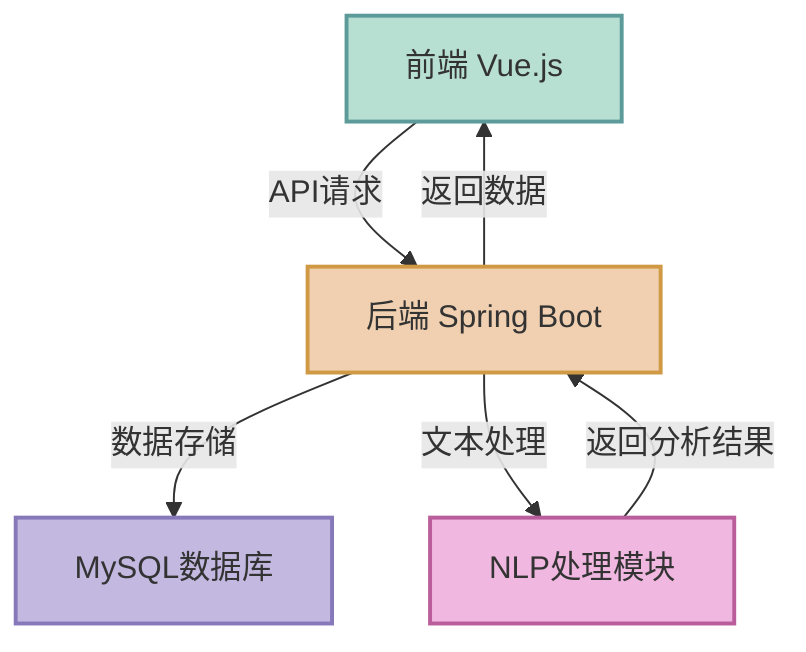

# 📚 NovelSight 小说智析 | Novel Assistant

<div align="center">
  
  
  
  
  <br><br>
  <p>
      <strong>AI驱动的小说内容分析与摘要生成系统</strong>
  </p>
  <p>
      <a href="#核心功能">💡 功能</a> •
      <a href="#快速开始">🚀 快速开始</a> •
      <a href="#系统架构">🏗️ 架构</a> •
      <a href="#技术栈">⚙️ 技术栈</a> •
      <a href="#项目进度">📊 进度</a>
  </p>
</div>

## 🌟 项目简介

> **让小说阅读更高效，内容理解更深入**

### 💬 那些年读小说踩过的坑

身为资深小说爱好者，我在阅读中频繁遇到这些困扰：

#### 📋 筛选困难
- 面对书架上几百本小说，不知道哪本"不踩雷"
- 简介写得天花乱坠，实际剧情拖沓、人设崩塌
- 想找"反套路"小说，却只能靠网友评论盲选，耗时又低效

#### 📖 理解费力
- 复杂世界观小说（如修真体系、星际设定），章节内容零散，理不清核心设定
- 长篇小说中穿插大量填充内容，想跳过"水章"却担心错过主线剧情

**NovelSight** 通过AI技术解析小说内容，提取关键情节，生成摘要和标签，为您省去筛选和理解的烦恼。无论是快速了解一部新小说，还是深入分析您喜爱的作品，小说智析都能提供专业帮助。

## 📅 开发日志

### 2025年4月14日
| 时间 | 工作内容 | 状态 |
|------|---------|------|
| **09:30-11:30** | 解决Spring Security循环依赖问题<br>修复AccessDeniedException错误 | ✅ |
| **13:00-15:00** | 完善管理员仪表盘路由配置<br>创建NovelManagementView和SystemLogsView组件<br>修复ESLint错误，优化代码结构 | ✅ |
| **15:30-17:30** | 实现用户登录状态管理和动态显示<br>优化Vuex存储，改进组件显示<br>完善登录流程，基于角色跳转 | ✅ |
| **17:30-18:00** | 代码优化与清理<br>美化登录按钮和用户下拉菜单样式 | ✅ |

## 📊 项目进度

### ✅ 已完成内容

<table>
  <tr>
    <td><b>基础架构搭建</b></td>
    <td>
      ✓ 前端框架搭建 (Vue.js 3 + Element Plus)<br>
      ✓ 后端框架搭建 (Spring Boot 2.7.12)<br>
      ✓ 数据库配置 (MySQL 8.0.33)<br>
      ✓ 基本API设计和实现
    </td>
  </tr>
  <tr>
    <td><b>用户认证系统</b></td>
    <td>
      ✓ 用户注册/登录功能<br>
      ✓ JWT令牌认证<br>
      ✓ 基于角色的权限控制<br>
      ✓ 登录状态管理和动态显示用户信息
    </td>
  </tr>
  <tr>
    <td><b>管理员后台</b></td>
    <td>
      ✓ 管理员仪表盘<br>
      ✓ 用户管理界面<br>
      ✓ 小说管理界面<br>
      ✓ 系统日志查看界面
    </td>
  </tr>
  <tr>
    <td><b>基础UI组件</b></td>
    <td>
      ✓ 导航栏和页面布局<br>
      ✓ 登录和注册表单<br>
      ✓ 用户下拉菜单<br>
      ✓ 小说列表显示
    </td>
  </tr>
  <tr>
    <td><b>核心业务流程</b></td>
    <td>
      ✓ 小说文件上传功能<br>
      ✓ 简单的章节识别与提取<br>
      ✓ 小说处理状态跟踪<br>
      ✓ 基本的小说详情查看
    </td>
  </tr>
  <tr>
    <td><b>系统安全性</b></td>
    <td>
      ✓ 解决Spring Security循环依赖问题<br>
      ✓ 修复AccessDeniedException错误<br>
      ✓ 优化认证授权流程
    </td>
  </tr>
</table>

### 🔄 待完成内容

<table>
  <tr>
    <th>类别</th>
    <th>任务</th>
    <th>优先级</th>
  </tr>
  <tr>
    <td rowspan="3"><b>核心功能强化</b></td>
    <td>增强中文网络小说的章节识别</td>
    <td>高</td>
  </tr>
  <tr>
    <td>改进摘要生成算法，减少重复内容</td>
    <td>高</td>
  </tr>
  <tr>
    <td>实现关键词提取和标签生成</td>
    <td>高</td>
  </tr>
  <tr>
    <td rowspan="3"><b>数据可视化</b></td>
    <td>关键词云实现</td>
    <td>中</td>
  </tr>
  <tr>
    <td>情节波动图绘制</td>
    <td>中</td>
  </tr>
  <tr>
    <td>小说结构分析可视化</td>
    <td>中</td>
  </tr>
  <tr>
    <td rowspan="3"><b>用户体验优化</b></td>
    <td>添加用户偏好设置</td>
    <td>中</td>
  </tr>
  <tr>
    <td>实现暗黑模式</td>
    <td>低</td>
  </tr>
  <tr>
    <td>优化移动端响应式设计</td>
    <td>中</td>
  </tr>
  <tr>
    <td rowspan="3"><b>高级分析功能</b></td>
    <td>小说内容情感分析</td>
    <td>低</td>
  </tr>
  <tr>
    <td>人物关系网络图生成</td>
    <td>低</td>
  </tr>
  <tr>
    <td>写作风格识别</td>
    <td>低</td>
  </tr>
  <tr>
    <td rowspan="3"><b>系统性能优化</b></td>
    <td>大文件处理性能优化</td>
    <td>中</td>
  </tr>
  <tr>
    <td>数据库查询优化</td>
    <td>中</td>
  </tr>
  <tr>
    <td>前端资源加载优化</td>
    <td>低</td>
  </tr>
</table>

## 💡 核心功能


### 🔍 自动化文本处理
- 🗃️ **多源输入**: 支持TXT、EPUB格式文件上传和网页链接解析
- 📑 **章节识别**: 自动识别章节标题，提取正文内容，过滤广告
- 🔄 **批量处理**: 支持批量导入和处理多部小说

### 📝 智能摘要生成
- 📌 **分层摘要**: 提供章节摘要、情节脉络图和全书概述
- 🧠 **内容理解**: 通过自然语言处理理解小说情节和主题
- 📊 **结构化输出**: 将非结构化文本转换为结构化信息

### 📈 数据可视化分析
- ☁️ **关键词云**: 直观展示小说关键词和核心概念
- 📉 **情节波动图**: 图形化展示故事情节起伏变化
- 🔬 **多维度分析**: 从多个角度分析小说风格和特点

### 🏷️ 个性化标签系统
- 👍 **推荐标签**: 突出小说的积极特点
- ⚠️ **避雷标签**: 提示小说的潜在问题
- 🚪 **阅读门槛**: 说明阅读所需的前置知识

## ⚙️ 技术栈

<div align="center">
  <table>
    <tr>
      <th>后端</th>
      <th>前端</th>
      <th>数据处理</th>
      <th>工具链</th>
    </tr>
    <tr>
      <td>
        <br>
        <br>
        <br>
        <br>
        <br>
        
      </td>
      <td>
        <br>
        <br>
        <br>
        <br>
        
      </td>
      <td>
        <br>
        <br>
        <br>
        
      </td>
      <td>
        <br>
        <br>
        <br>
        <br>
        
      </td>
    </tr>
  </table>
</div>

### 后端技术详情

* **基础框架**: Spring Boot 2.7.12 - 简化Spring应用开发的框架
* **安全框架**: Spring Security 5.7.8 - 提供认证、授权和保护机制
* **数据持久层**: 
  * Spring Data JPA 2.7.12 - 简化数据库访问
  * Hibernate ORM 5.6.15 - 对象关系映射框架
  * MySQL 8.0.33 - 数据库系统
* **API安全**: 
  * JWT (JSON Web Token) 0.11.5 - 无状态会话管理
  * BCrypt - 密码加密哈希算法
* **文档解析**:
  * JSoup 1.16.1 - HTML解析库
  * EPUB Parser 3.1 - 电子书格式解析
* **自然语言处理**: 
  * HanLP portable-1.8.4 - 汉语言处理包
  * 自定义分词和摘要算法

### 前端技术详情

* **核心框架**: 
  * Vue.js 3.2.47 - 渐进式JavaScript框架
  * Vuex 4.0.2 - 状态管理模式和库
* **UI组件**: 
  * Element Plus 2.3.5 - 基于Vue的桌面端组件库
  * 自定义组件和样式
* **路由**: Vue Router 4.1.6 - 官方路由管理器
* **HTTP客户端**: Axios 1.4.0 - 基于promise的HTTP客户端
* **可视化**: ECharts 5.4.2 - 数据可视化库

### 开发环境与工具

* **JDK**: Oracle JDK 11.0.21 (LTS版本)
* **构建工具**: Apache Maven 3.8.8
* **前端包管理**: Node.js 16.20.1 + npm 8.19.4
* **开发工具**: 
  * IntelliJ IDEA 2023.1 - 后端开发
  * Visual Studio Code 1.82.0 - 前端开发
* **代码简化**: Lombok 1.18.26 - 减少Java模板代码
* **版本控制**: Git 2.40.1

## 🏗️ 系统架构


```mermaid
graph TD
    A[前端 Vue.js] -->|API请求| B[后端 Spring Boot]
    B -->|数据存储| C[MySQL数据库]
    B -->|文本处理| D[NLP处理模块]
    D -->|返回分析结果| B
    B -->|返回数据| A
    
    style A fill:#b8e0d2,stroke:#5d9b9b,stroke-width:2px
    style B fill:#f0d0b0,stroke:#d09a45,stroke-width:2px
    style C fill:#c3b8e0,stroke:#8778ba,stroke-width:2px
    style D fill:#f0b8e0,stroke:#ba5d9b,stroke-width:2px
```

## 🚀 快速开始

### 📋 系统要求
- ☕ Java 11.0+ (推荐使用JDK 11.0.21)
- 🟢 Node.js 16+ (推荐使用16.20.1)
- 🐬 MySQL 8.0+
- 🏗️ Maven 3.6+

### 🔧 安装步骤

<details>
<summary><b>1. 配置数据库</b></summary>

```bash
# 创建数据库和表结构
mysql -u root -p < sql/schema.sql

# 可选：导入示例数据
mysql -u root -p < sql/sample_data.sql
```
</details>

<details>
<summary><b>2. 配置后端</b></summary>

```bash
cd backend
# 修改application.properties中的数据库连接信息
mvn clean install
```
</details>

<details>
<summary><b>3. 启动后端服务</b></summary>

```bash
mvn spring-boot:run
```
</details>

<details>
<summary><b>4. 安装和启动前端</b></summary>

```bash
cd ../frontend
npm install
npm run serve
```
</details>

<details>
<summary><b>5. 访问应用</b></summary>

打开浏览器访问 http://localhost:8081
</details>

## 📱 使用流程

<div align="center">
  <table>
    <tr>
      <td align="center"><b>步骤1</b><br>登录/注册</td>
      <td align="center"><b>步骤2</b><br>上传小说</td>
      <td align="center"><b>步骤3</b><br>等待处理</td>
      <td align="center"><b>步骤4</b><br>浏览分析</td>
      <td align="center"><b>步骤5</b><br>保存/分享</td>
    </tr>
    <tr>
      <td align="center">👤</td>
      <td align="center">📤</td>
      <td align="center">⏳</td>
      <td align="center">📊</td>
      <td align="center">💾</td>
    </tr>
  </table>
</div>

## 🎯 性能指标

- 📦 支持单文件最大**150MB** (约300万字)
- ⚡ 平均处理速度: **100万字/5分钟**
- 📈 摘要准确率: **>85%** (基于人工评估)

## 🔮 版本历史

- **v0.9.0** (2025-04-14): 基础版发布
  - 完成基础架构搭建
    - 后端: Spring Boot 2.7.12 + Spring Security 5.7.8 + JPA
    - 前端: Vue.js 3.2.47 + Element Plus 2.3.5
    - 数据库: MySQL 8.0.33
  - 实现用户认证系统
    - JWT令牌认证（使用jjwt 0.11.5）
    - 基于BCrypt的密码加密
    - 角色权限控制
  - 开发管理员后台
    - 仪表盘数据统计
    - 用户管理界面
    - 小说管理界面
  - 构建基础UI组件
    - 响应式页面布局
    - 动态主题支持
  - 实现核心业务流程
    - TXT/EPUB解析
    - 章节识别算法
  - 优化系统安全性
    - CORS配置
    - XSS防护

## 📝 贡献指南

我们欢迎各种形式的贡献，包括但不限于:

- 🐛 提交Bug报告和功能请求
- 📚 改进文档
- 💻 提交代码修复或新功能
- 🔍 分享使用体验和建议

### 编码规范

- 后端代码遵循Google Java代码规范
- 前端代码遵循Vue.js风格指南

## 📜 许可证

本项目采用MIT许可证。详见 [LICENSE](LICENSE) 文件。

## 📞 联系方式

- 项目维护者: [七七](mailto:tanqi03@126.com)

---

<div align="center">
  <sub>用❤️构建 | MIT许可证</sub>
</div> 
