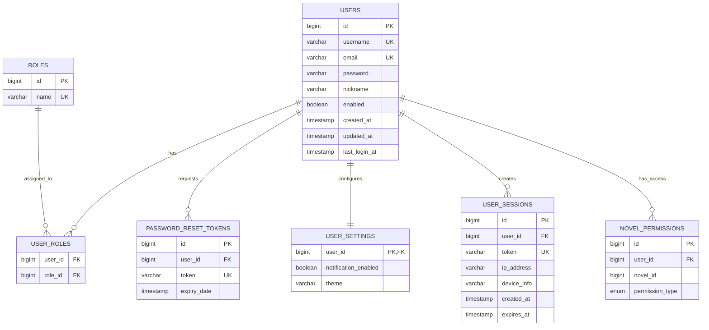

# 认证系统 ER 图

## Mermaid ER 图

## 表关系说明

1. **Users 与 Roles**：多对多关系，通过 user_roles 关联表实现
   - 一个用户可以拥有多个角色（如：既是普通用户又是管理员）
   - 一个角色可以分配给多个用户

2. **Users 与 UserSettings**：一对一关系
   - 每个用户有一个唯一的设置配置

3. **Users 与 PasswordResetTokens**：一对多关系
   - 一个用户可以有多个密码重置令牌（历史记录）

4. **Users 与 UserSessions**：一对多关系
   - 一个用户可以有多个活跃会话（不同设备登录）

5. **Users 与 NovelPermissions**：一对多关系
   - 一个用户可以拥有对多个小说的不同权限

## 安全设计说明

1. **密码存储**：
   - 用户密码使用BCrypt算法加密存储，不存储明文
   - 数据库中只保存哈希值，即使数据泄露也无法直接获取原始密码

2. **会话管理**：
   - 使用JWT令牌管理用户会话，存储在user_sessions表中
   - 令牌有明确的过期时间，提高安全性
   - 记录设备及IP信息，便于追踪可疑登录

3. **权限隔离**：
   - 基于角色的访问控制(RBAC)，通过roles和user_roles实现
   - 细粒度权限控制，通过novel_permissions实现对数据资源的访问控制 